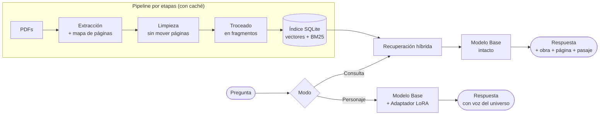

<div align="center">

# 📚 books_ai

**Consulta un corpus de libros con un LLM que corre entero en tu máquina.**
Responde con la página y el pasaje literal, o te contesta con la voz del universo.

[](https://www.python.org/)
[](./LICENSE)
[](https://rocm.docs.amd.com/)
[](https://www.amd.com/)
[](https://github.com/ggml-org/llama.cpp)
[](https://github.com/asg017/sqlite-vec)
[](#estado-del-proyecto)

</div>

---

## ⚠️ Estado del proyecto

**No hay código todavía.** El diseño está cerrado y documentado, el conjunto de evaluación
está escrito y validado, y el trabajo está descompuesto en 13 tickets. La implementación
no ha empezado.

Este README describe **cómo va a funcionar** y **qué necesitarás** para hacerlo funcionar.
Nada de lo que hay debajo es ejecutable aún.

| | |
|---|---|
| Diseño | ✅ cerrado — [`app.md`](./app.md) |
| Glosario del dominio | ✅ 16 términos — [`CONTEXT.md`](./CONTEXT.md) |
| Decisiones registradas | ✅ 4 ADRs — [`docs/adr/`](./docs/adr/) |
| Conjunto de evaluación | ✅ 58 preguntas validadas — [`eval/`](./eval/) |
| Implementación | ⬜ 13 tickets — [`.scratch/primera-vuelta/`](./.scratch/primera-vuelta/) |

---

## 📖 Los libros los pones tú

**Este repositorio no incluye ningún libro y nunca lo hará.** Los textos tienen derechos de
autor: el corpus está en `.gitignore` a propósito y jamás debe subirse.

Para usar el proyecto tienes que aportar **tus propias copias legalmente obtenidas**, en
PDF con capa de texto (no escaneos: no hay OCR en el pipeline), organizadas por universo:

```
books/
├── La Tierra Media/
│   ├── El Hobbit.pdf
│   ├── El Silmarillion.pdf
│   └── El Señor de los Anillos - 01 La comunidad del anillo.pdf
└── GOT/
    ├── 1 Juego de tronos.pdf
    └── 2 Choque de reyes.pdf
```

Cada subcarpeta de `books/` es un **Universo**, y el universo es un filtro obligatorio de
toda consulta: el sistema nunca responde ni cita fuera del que hayas elegido.

> **Nota sobre el corpus de referencia.** El diseño y el conjunto de evaluación se
> construyeron sobre 15 obras (≈3,36 M palabras, 7.612 páginas) de Tolkien y G.R.R. Martin
> en castellano. Si aportas otros libros, el conjunto de evaluación de `eval/` **no te
> servirá** y tendrás que escribir el tuyo — es lo primero que hay que hacer, no lo último.

### Comprueba que tus PDFs valen

```bash
pdftotext -q "books/GOT/1 Juego de tronos.pdf" - | wc -w
```

Si devuelve unos pocos cientos de palabras o cero, ese PDF es un escaneo y no sirve.

---

## 🔧 Requisitos

### Hardware

| | |
|---|---|
| **De referencia** | AMD Strix Halo (Ryzen AI MAX+ 395), GPU `gfx1151`, 128 GB de memoria unificada |
| **Reparto de memoria** | El diseño asume ~96 GiB asignados a la GPU en la BIOS y ~30 GiB para el sistema |
| **Mínimo realista** | Cualquier GPU con ≥16 GB para servir un modelo de clase 8B cuantizado |

El proyecto está escrito contra AMD/ROCm, pero nada del Modo Consulta es específico de
AMD: si tienes CUDA, sustituye el stack de servicio y funciona igual.

### Software

| Requisito | Para qué |
|---|---|
| **`poppler-utils`** (`pdftotext`, `pdfinfo`) | Extraer texto y páginas de los PDFs |
| **Python 3.12** con [`uv`](https://github.com/astral-sh/uv) | El pipeline. **Python 3.13+ no vale**: sin ruedas para buena parte del stack de ML |
| **Un locale UTF-8** (o `PYTHONUTF8=1`) | Media docena de Obras llevan acentos en el nombre del fichero, y de ahí sale el nombre de la Obra en cada Cita. Con otra codificación saldrían corruptas, así que el CLI se niega a arrancar |
| **[`llama.cpp`](https://github.com/ggml-org/llama.cpp)** (`llama-server`) | Servir el modelo generativo **y** calcular los embeddings |
| **Podman + toolbox** *(recomendado en AMD)* | Aislar ROCm sin tocar el sistema anfitrión |
| **ROCm 7.x** | Sólo si vas a entrenar. El Modo Consulta no lo necesita |
| **PyTorch ROCm nightly** ([TheRock](https://github.com/ROCm/TheRock)) | Sólo para entrenar el adaptador, en un contenedor aparte |

Para AMD Strix Halo, los toolboxes de
[`kyuz0/amd-strix-halo-toolboxes`](https://github.com/kyuz0/amd-strix-halo-toolboxes)
traen ROCm y `llama.cpp` ya compilados y ahorran la parte más ingrata.

> **El Modo Consulta no necesita PyTorch en ningún punto.** `llama-server` calcula los
> embeddings con `--embedding`, así que toda la parte de consulta vive dentro del stack de
> inferencia. PyTorch sólo aparece si quieres entrenar. Ver [ADR-0003](./docs/adr/0003-entrenamiento-y-servicio-en-stacks-separados.md).

---

## 🏗️ Cómo funciona

Dos modos, y cada uno usa la técnica en la que es bueno.



**Modo Consulta** responde hechos y los cita. Recuperación híbrida —vector denso más BM25
léxico, porque un corpus lleno de nombres inventados como *Invernalia* o *Bombadil*
favorece la búsqueda léxica— sobre un índice que es **un solo fichero SQLite**, sin ningún
servicio que levantar. Si el corpus no cubre la pregunta, lo dice.

**Modo Personaje** responde con la voz del universo. Lo sirve un adaptador LoRA que se
conmuta en caliente sobre el mismo modelo base.

**La clave está en la separación:** el Modo Consulta corre **siempre** sobre el modelo base
sin modificar, así que ningún entrenamiento fallido puede degradar la herramienta. Ver
[ADR-0002](./docs/adr/0002-adaptador-conmutable-sobre-modelo-base-intacto.md).

### Por qué no es "afinar un modelo con los libros"

Era el plan original, y se descartó. El fine tuning sobre millones de tokens de narrativa
memoriza de forma irregular, no distingue lo aprendido de lo alucinado y no puede decir de
dónde salió una afirmación. Para responder hechos de forma verificable no sirve. Se reserva
para la voz, donde no hay nada que verificar. Ver
[ADR-0001](./docs/adr/0001-recuperacion-para-hechos-fine-tuning-para-voz.md).

---

## 🎯 La vara de medir

El proyecto se construye alrededor de un **conjunto de evaluación escrito antes de elegir
ningún modelo**: 58 preguntas con respuesta y cita conocidas, verificadas una a una contra
el texto real.

| Familia | Nº | Qué mide |
|---|---:|---|
| Directas | 29 | Acierto del hecho **y** corrección de la cita, por separado |
| Multi-salto | 12 | Conectar dos hechos, a veces entre obras distintas |
| **Negativas** | 9 | Decir «no lo sé». Lo único que detecta alucinación |
| **Cruzadas** | 8 | Callar al preguntar por un universo con el filtro en el otro |

Verificarlas destapó trampas reales en el corpus —entre ellas un **«Sauron Lenguasalada»**
en los libros de Martin— documentadas en
[`eval/trampas-detectadas.md`](./eval/trampas-detectadas.md).

---

## 🚀 Cómo se arranca

```bash
uv sync                      # crea el entorno con Python 3.12
uv run books-ai pipeline list
```

### El pipeline

Cada etapa declara qué artefacto consume y cuál produce, y sólo corre si algo cambió.

```bash
uv run books-ai pipeline run                 # todo lo que no esté al día
uv run books-ai pipeline run inventario      # una etapa y las que necesita por delante
uv run books-ai pipeline run inventario --only --force
uv run books-ai pipeline invalidate inventario   # arrastra a las dependientes
```

Lo que decide si una etapa está al día es su **recibo** en `.cache/receipts/`: la huella
sha256 de cada entrada, la de cada salida y la versión de la etapa. Cambia un PDF y se
recalcula lo que depende de él; no cambia nada y la segunda pasada tarda una décima de
segundo. Para forzar el recálculo de un cambio que el contenido no delata —otro troceado,
otra limpieza— se sube la `version` de la etapa.

### El Modelo de Embeddings

Se sirve con `llama-server`, aparte del pipeline:

```bash
hf download gpustack/bge-m3-GGUF bge-m3-FP16.gguf --local-dir ~/Code/models/bge-m3-GGUF
scripts/embeddings-server.sh &
uv run books-ai embeddings probe
```

**BGE-M3 en GGUF está confirmado** sobre `llama.cpp` `b10590`: 1.024 dimensiones, contexto
de 8.192 y vectores normalizados. Se sirve en FP16 —cuantizar un modelo de embeddings se
paga en calidad de recuperación— y con `--pooling cls`, que es como fue entrenado; con
`--pooling none` el servidor devuelve un vector por token y el cliente lo rechaza en vez de
aplastarlo en silencio.

### Las pruebas

```bash
uv run pytest                # 66, sin necesidad de GPU ni de PDFs
uv run mypy && uv run ruff check .

# La comprobación contra un llama-server de verdad, que si no se salta sola:
BOOKS_AI_EMBEDDINGS_URL=http://127.0.0.1:8081 uv run pytest tests/test_embeddings_live.py
```

---

## 📂 Estructura

```
app.md                          El diseño completo
CONTEXT.md                      Glosario del dominio (16 términos)
src/books_ai/pipeline/          Etapas con caché: recibos y huellas
src/books_ai/embeddings.py      Cliente del Modelo de Embeddings
src/books_ai/corpus.py          Las dos primeras etapas sobre el Corpus
scripts/embeddings-server.sh    Levanta BGE-M3 en llama-server
docs/adr/                       Las 4 decisiones caras de revertir
eval/conjunto-evaluacion.yaml   58 preguntas validadas
eval/trampas-detectadas.md      Trampas del corpus
.scratch/primera-vuelta/        13 tickets, en orden de dependencia
books/                          Tus libros. Fuera del repo por .gitignore
```

## 🗺️ Por dónde empezar

Los tickets sin bloqueos son el **01** (esqueleto de etapas y entorno, camino crítico) y el
**09** (contenedor de entrenamiento, independiente de todo lo demás). El orden completo
está en [`.scratch/primera-vuelta/README.md`](./.scratch/primera-vuelta/README.md).

## 📜 Licencia

[MIT](./LICENSE) © 2026 Ricardo Montañana.

La licencia cubre **el código y la documentación de este repositorio**, nunca los libros que
aportes: sus derechos son de sus autores y editoriales.
